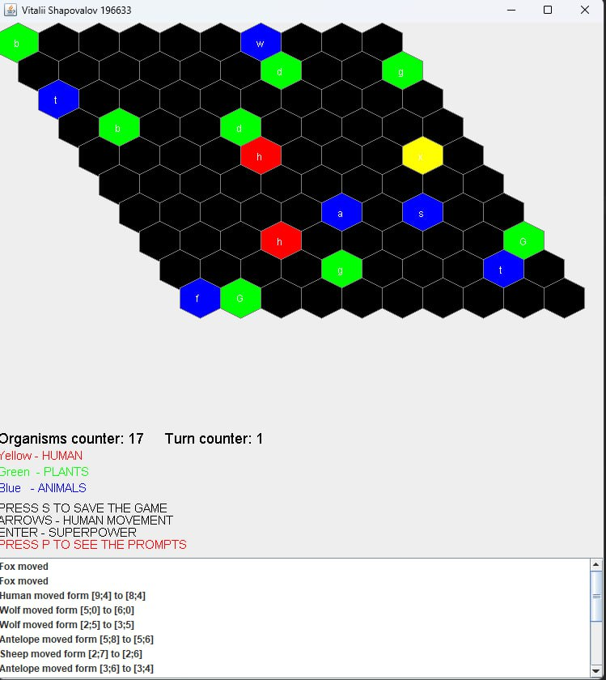

# Virtual World Simulator

## Introduction

The goal of this project is to implement a program simulating a virtual world, which has the structure of a two-dimensional grid with an arbitrary size of NxM. In this world, there will be simple life forms with different behaviors. Each organism occupies exactly one cell in the grid, and at most one organism can be present on each cell (in case of collision, one of them should be removed or moved).
The simulator will operate in turns. In each turn, all organisms existing in the world will perform an action appropriate to their type. Some of them will move (animal organisms), while others will remain stationary (plant organisms). In case of collision (two organisms occupying the same cell), one organism wins by either killing (e.g., a wolf) or repelling (e.g., a turtle) the competitor. The order of movements of organisms in a turn depends on their initiative. Animals with the highest initiative move first. In case of animals with the same initiative, the order is determined by seniority (the older one moves first). Victory in encounters depends on the strength of the organism, although there will be exceptions to this rule (see: Table 2). In case of equal strength, the attacking organism wins. A specific type of animal will be the Human. Unlike animals, the human does not move randomly. The direction of their movement is determined before the start of the turn using the arrow keys on the keyboard. The human also has a special ability (see Appendix 1) that can be activated by a separate button. The activated ability remains active for 5 consecutive turns, after which it is deactivated. After deactivation, the ability cannot be activated again until 5 consecutive turns have passed. When the program starts, there should be several instances of all types of animals and plants on the grid. The program window should contain a field where information about the results of fights, plant consumption, and other events in the world will be displayed.

## Implementation Notes

- The world grid should be represented as a two-dimensional array.
- Turn-based logic is implemented to handle the actions of organisms in each turn.
- The human's movement is determined by keyboard input, and special ability activation should be handled by a separate button.
- The program interface should visual feedback on the events happening in the world.

## Example

